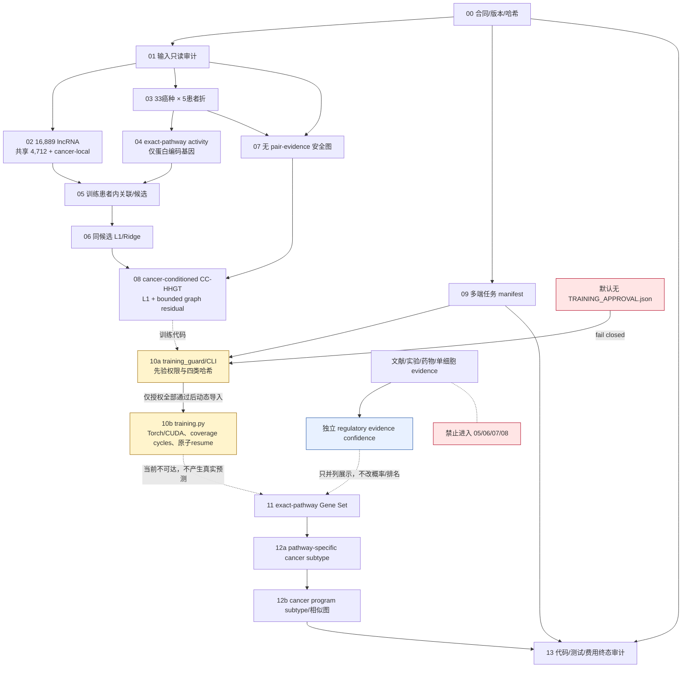
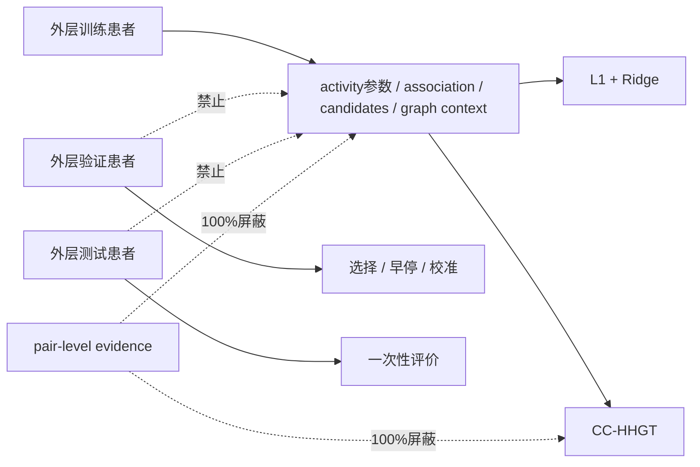
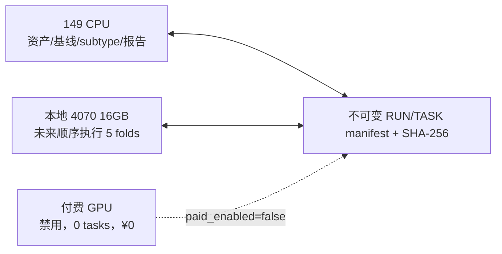
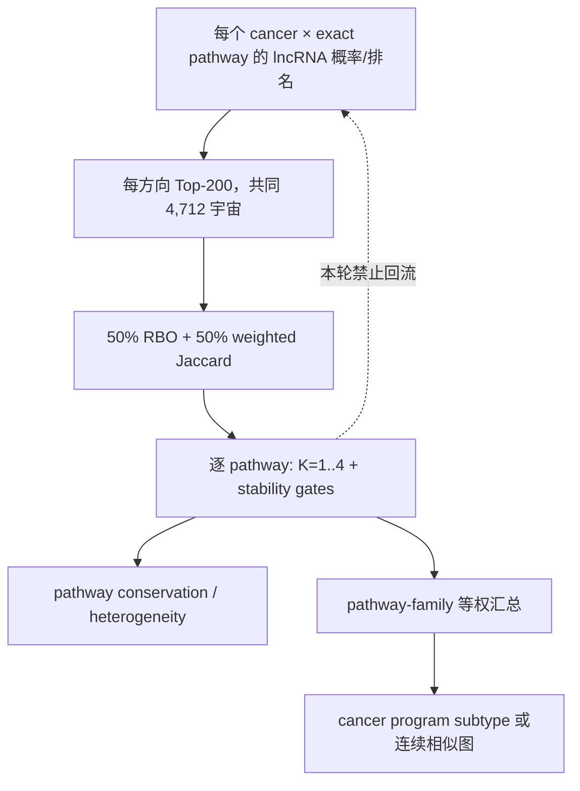

# CancerLncAtlas V3.2 Pipeline DAG

状态：`CODE_ONLY`。下图是代码依赖和未来获授权后的执行责任，不表示任何任务已经训练。

## Fold-local 泄漏边界

改变验证或测试患者时，`FIT` 侧的候选、关联、安全图和训练资产哈希必须保持不变。

## 端点所有权

- 当前不连接 149；这里只定义将来获授权后的 CPU owner。
- 当前不初始化本地 CUDA；五个任务在 manifest 中均为 `BLOCKED`。
- 付费端必须同时具备独立 shard、非零预算和哈希匹配授权；当前三个条件均不成立。
- 多端不得同时拥有同一 task key；跨硬件不得续接 optimizer/checkpoint。
- `training.py` 只有在 guard 通过后才被动态导入；届时 checkpoint 同时绑定代码/配置/输入/任务哈希和 runtime fingerprint，任何漂移均拒绝 resume。

## 下游 subtype 方向

因此，DNA repair、EMT 或 immune pathway 可以各自产生不同的癌种分组；不存在强制所有 pathway 共享同一个癌症聚类。
